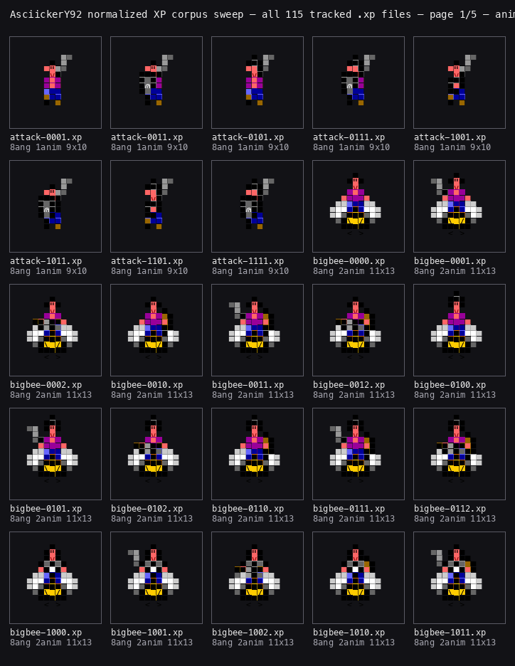
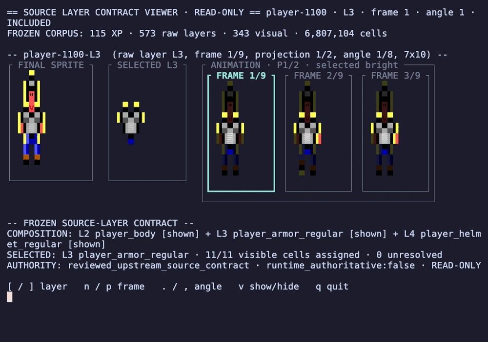
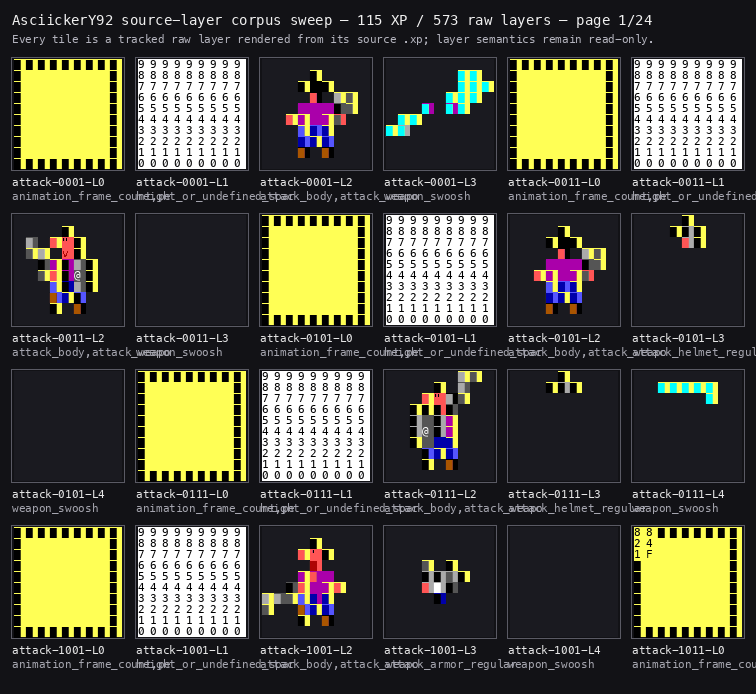

# Asciicker Y9-2 XP Sprite Inspector

Two read-only terminal viewers for Asciicker Y9-2 REXPaint sprites. Browse all
115 packaged sprites, inspect their layers, and step through animation frames
without launching the game.

Use the **normalized inspector** for body regions and UV coordinates, or the
**source-layer viewer** for raw layers and how they combine. Both run on
Python 3.11 or newer, with no extra runtime dependencies. Neither edits sprites
or review data.

## Normalized UV/body inspector

See the composed sprite beside reviewed body regions and atlas coordinates.
The default `player-1100.xp` view combines the base, armor, and helmet, with
armor on L3 and helmet on L4.

```sh
./run-inspector.sh
```

Navigate with the arrow keys. Use `a`/`d` for angles, `w`/`s` for animations,
`,`/`.` for frames, `r`/`f` for regions, `g` for the angle grid,
`b` for body-map bands, and `q` to quit.

### Walkthrough


### All 115 sprites



## Source-layer viewer

Browse all 573 raw layers across the same 115 sprites. Compare a selected layer
with the combined sprite, inspect reviewed cell roles, and change frames,
angles, or projections.

```sh
./run-viewer.sh
```

For the compact armor view shown below:

```sh
./run-viewer.sh --source-key player-1100-L3 --compact
```

Use `{`/`}` for sprites, `[`/`]` for layers, `n`/`p` for frames,
`.`/`,` for angles, `r` for projections, `v` to hide or show a layer,
and `q` to quit.

### Walkthrough



### All 573 source layers



## One-shot output

Both runtimes can print a view without an interactive terminal:

```sh
./run-inspector.sh --once
./run-viewer.sh --once
```

## Data and recordings

XP files live in `assets/sprites/`. In the normalized layout, L0 holds the color
key, L1 holds metadata, L2 is the base visual layer, and L3+ holds overlays.
The viewers read the packaged sprites and historical review records; they do
not edit assignments, anchors, or game data.

- [Included review data](docs/historical-evidence/)
- [Sprite attribution](docs/ATTRIBUTION.md) and [source provenance](docs/provenance.md)
- [Repository merge and recovery details](docs/consolidation.md)

To rebuild the normalized walkthrough, install
[the recording dependencies](docs/requirements-recording.txt) and run
`./scripts/regenerate_armored_inspector_gif.py` with VHS 0.11.0.
`./scripts/build-recording.sh` rebuilds the source-layer walkthrough.
