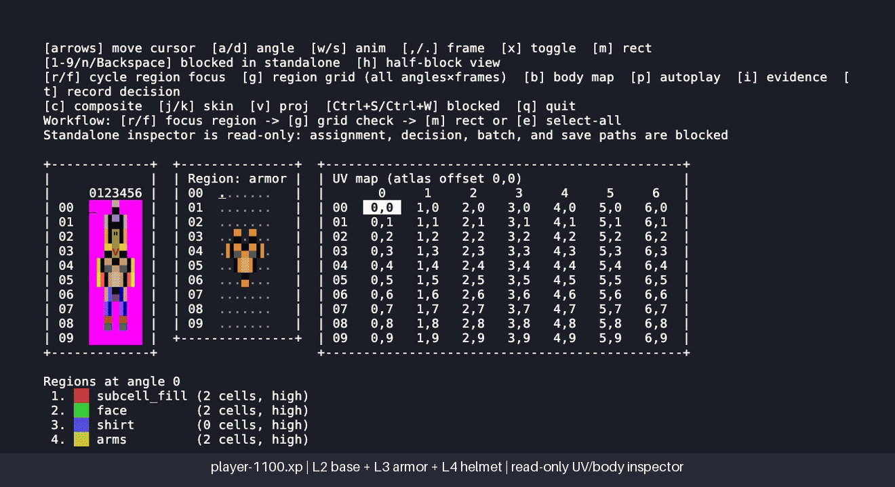

# AsciickerY92 Normalized XP Sprite Inspector

A standalone, read-only terminal inspector for the Asciicker Y9-2 normalized
REXPaint XP sprite-to-UV/body contract. It packages the real
`xp_uv_body_viewer.py` surface, one reviewed armored player sprite, its anchor
map, and the bounded parser/semantic helpers needed to run independently of
the parent repository.

The previous 7x9 layer/frame browser was a product substitution. It and its GIF
were removed; they did not expose any UV/body relationship.

## Run

Python 3.11 or newer is the only dependency.

```sh
./run-inspector.sh
```

The interactive screen relates three views of the selected sprite cell:

- the engine-order composition of base, armor, and helmet layers;
- the focused semantic body region and its cells across angles; and
- atlas-global UV coordinates for every cell in the frame.

Navigation includes arrow keys, `a`/`d` for angle, `w`/`s` for animation,
`,`/`.` for frame, `r`/`f` for region focus, `g` for the angle grid, `b` for a
packaged body-map band when present, and `q` to quit. Assignment, anchor save,
review-decision capture, and batch mutation are blocked in this standalone.

For deterministic non-TTY execution of the same UV/body rendering surface:

```sh
./run-inspector.sh --once
```

## Product boundary and status

This repository provides inspection, not authoring. The packaged anchor JSON,
sprite, and evidence cards are inputs and must remain byte-identical while the
program runs. Tests exercise the real screen, rejection of the historical batch
mutation interface, and direct rejection by the save and decision functions.

The replacement is **Verified** by automated read-only contracts and a
byte-bound, dependency-free decoded recording artifact. Personal visual
acceptance remains a separate human gate. Source identities and local hardening
are recorded in [docs/ATTRIBUTION.md](docs/ATTRIBUTION.md).

The default fixture is `player-1100.xp`, whose five raw layers include the
normalized base at L2, reviewed armor overlay at L3, and reviewed helmet overlay
at L4. The first screen composes L2-L4 and focuses the armor region; the region
grid reads the focused region's recorded source layer rather than pretending all
regions belong to L2.

## Real inspector walkthrough



The recording starts directly in the alternate-screen product UI (the startup
command is deliberately hidden). It shows the composed armored sprite with its
UV panel, then the armor grid (`source L3`), and then the helmet grid (`source
L4`) after navigation to another angle. A persistent lower-canvas label names
the fixture and layer ownership—`player-1100.xp | L2 base + L3 armor + L4
helmet`—without cropping or modifying the product screen.

Regenerate the committed artifact—never run the tape directly—with:

```sh
python3 -m pip install -r docs/requirements-recording.txt
./scripts/regenerate_armored_inspector_gif.py
```

The command requires VHS 0.11.0 and recording-only `Pillow==12.1.0` from
[`docs/requirements-recording.txt`](docs/requirements-recording.txt). The tape
creates only `/tmp/p0c03-armored-inspector.raw.gif`; the script captions a
temporary candidate with Pillow's built-in font, dependency-freely verifies the
candidate's dimensions, every frame, every caption band, and all four required
product states against the accepted artifact, then publishes the GIF and its
exact hash receipt only after those semantic/perceptual checks pass.

The committed artifact remains byte-bound by
[`docs/armored-inspector.contract.json`](docs/armored-inspector.contract.json): it
LZW-decodes and composites the GIF without image libraries, then checks its
1320×720 canvas, every recorded product frame and caption band, plus four
semantic state fingerprints. VHS timing and rasterization are not byte-stable;
the regenerator therefore applies a bounded visual-similarity gate before it
writes the new exact receipt. Manually inspect the composed UV/body view, L3
armor grid, L4 helmet grid, and changed-angle L4 grid after any intentional
regeneration.
